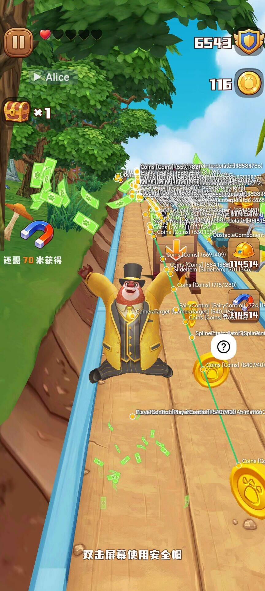
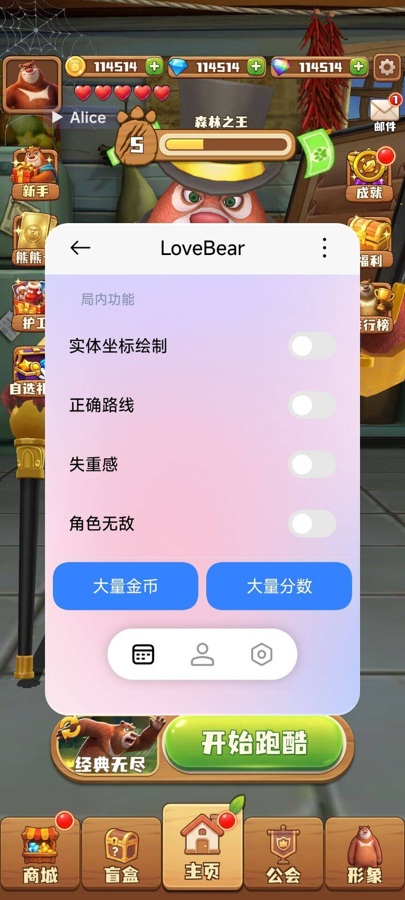

# LoveBear

LoveBear 是面向《熊出没之熊大快跑》（包名：`com.joym.xiongdakuaipao`）的 LibXposed 模块。模块会在游戏进程加载后注入一个可收起的悬浮球和控制面板，用于调试 Unity/IL2CPP 运行时以及验证游戏内状态。

> 本项目不是游戏本体，也不是官方插件。请仅在自己的设备和测试账号上使用，并遵守游戏服务条款及当地法律法规。

## 功能

- **实体坐标绘制**：在游戏画面上显示活动中的 MonoBehaviour 实体、类型和坐标。
- **正确路线**：读取金币实体并按运行时坐标绘制收集路线。
- **失重感**：切换角色重力值。
- **角色无敌**：切换角色的无敌状态及持续时间。
- **大量金币 / 大量分数**：将当前角色的金币或分数写入较大的测试值。
- **悬浮 UI**：基于 Jetpack Compose 和 Miuix，支持悬浮球与可拖动窗口。

功能是否可用取决于游戏版本、运行时加载时机和设备环境；游戏更新后可能需要重新适配。

## 截图

<table>
  <tr>
    <td></td>
    <td></td>
  </tr>
</table>

## 安装

### 使用预构建 APK

仓库内的 [`app/release/LoveBear_v1.0.apk`](./app/release/LoveBear_v1.0.apk) 是一个可直接安装的 Release 构建产物。

1. 在 Android 设备上安装并配置支持 **LibXposed API 101+** 的框架（例如 LSPosed 的相应实现）。
2. 安装 `LoveBear_v1.0.apk`。
3. 在框架管理器中启用 LoveBear。模块作用域已声明为 `com.joym.xiongdakuaipao`，如管理器要求手动选择作用域，请仅选择该游戏。
4. 完全结束游戏进程后重新启动游戏。进入游戏后，屏幕边缘会出现 LoveBear 悬浮球，点击即可打开面板。

模块没有独立的启动 Activity，直接点击桌面图标不会打开控制面板；必须通过已注入的目标游戏进程使用。

### 从源码构建

环境要求：

- Android Studio / Android Gradle Plugin `9.2.1`
- JDK `21`
- Android SDK 37、NDK 和 CMake `3.22.1`
- 可访问 Google Maven、Maven Central 和 JitPack

在项目根目录执行：

```bash
./gradlew :app:assembleRelease
```

生成的 APK 位于 `app/build/outputs/apk/release/app-release.apk`。当前构建包含 `arm64-v8a` 和 `armeabi-v7a` 两种 ABI，最低 Android API 为 33（Android 13）。

## 使用说明

1. 确认游戏已经进入实际关卡，再打开悬浮球中的面板。
2. 在“局内功能”中开启需要的开关；实体坐标和正确路线会以透明覆盖层绘制在游戏画面上。
3. “大量金币”和“大量分数”是即时写入当前角色状态的操作。切换关卡或重启游戏后，数值可能被服务器或游戏逻辑覆盖。
4. 关闭面板后，控制窗口会隐藏，悬浮球仍会保留在屏幕边缘。

## 兼容性与限制

- 目标进程：`com.joym.xiongdakuaipao`。
- 注入入口依赖 `com.joym.sdk.core.GGameActivity`；如果游戏更换 Activity、包名或 Unity 结构，模块可能无法启动。
- 原生层通过 `libil2cpp.so` 查找 Unity/IL2CPP 类、字段和实体快照，因此强依赖目标游戏的 IL2CPP 版本和字段布局。
- 当前 Release 未启用代码混淆或资源压缩，且使用调试签名配置，仅适合个人测试。
- 在线模式、不同游戏版本和非 ARM 设备未作兼容性保证。

## 故障排查

**看不到悬浮球或面板**

- 检查框架中模块是否已启用，并确认作用域是 `com.joym.xiongdakuaipao`。
- 从最近任务中划掉游戏，重新启动目标进程；不要只返回桌面。
- 确认设备满足 Android 13/API 33 及 ARM ABI 要求，并允许框架显示悬浮窗。

**面板出现但功能无效**

- 等待游戏进入关卡后再开启功能，确保 `libil2cpp.so` 已加载。
- 查看模块日志（关键字：`LoveBear`、`LoveBearNative`）。若出现 `initUnityResolve failed`，通常表示运行时尚未就绪或游戏版本不匹配。
- 更新游戏后仍然失败时，请附上游戏版本、Android 版本和相关日志再提交 Issue，不要上传账号或个人数据。

## 实现概览

- Kotlin 层：LibXposed 生命周期回调、Compose 控制面板、EasyFloat 悬浮窗和透明实体覆盖层。
- 原生层：C++ 通过 UnityResolve 访问 IL2CPP，结合 KittyMemory、Dobby 和 xDL 完成符号解析、字段读写与实体快照采集。
- `NativeFunctions` 提供 Kotlin 与 JNI 之间的运行时查找、字段读写、方法调用接口。

## 许可

本项目代码以 [Apache License 2.0](./LICENSE) 发布。仓库中集成的第三方库（包括 UnityResolve、KittyMemory、Dobby、xDL 等）仍受其各自许可证约束；重新分发时请同时遵守对应项目的许可和署名要求。

## 反馈

请通过 GitHub Issues 提交可复现的问题，并说明模块版本、游戏版本、设备 Android 版本、CPU ABI 以及相关日志。作者 Telegram 频道：[@niubimokuai](https://t.me/niubimokuai)。外部联络渠道的真实性请自行核验。
